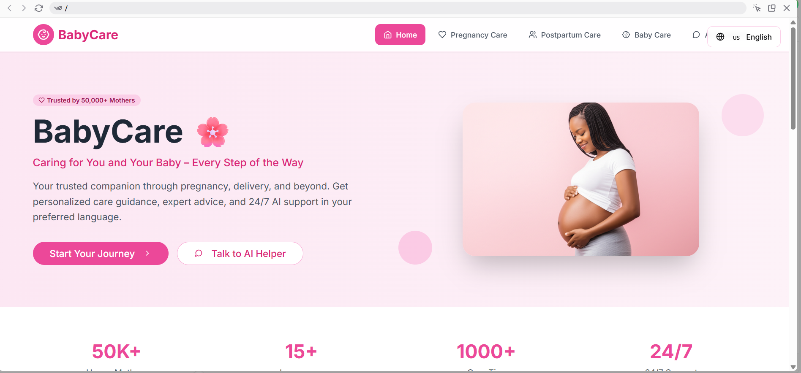

# 👶🌸 BabyCare - Caring for You and Your Baby Every Step of the Way



## 💖 Overview

**BabyCare** is a beautiful, AI-powered website designed to support mothers throughout their pregnancy and parenting journey.  
From week-by-week pregnancy guidance to postpartum care, newborn care, and 24/7 AI assistance — BabyCare is the perfect companion for expecting and new moms.

---

## 🌟 Features

### 🏠 Home Page
- Soft pink soothing UI.
- Trusted by over 50,000+ mothers.
- AI-powered companion for moms in multiple languages.

### 🤰 Pregnancy Care
- Week-by-week updates on baby size and development.
- Common symptoms and useful weekly tips.
- Downloadable personalized pregnancy guide.


### 🤱 Postpartum Care
- Recovery guidance, breastfeeding tips, emotional wellness support.

### 👶 Baby Care Guide
- Newborn care, feeding guides, sleep schedules, milestone tracking.

### 🤖 AI Assistant
- 24/7 "AI Mommy Helper" to instantly answer pregnancy and baby care questions.
- Supports multiple languages and categories like pregnancy, newborn care, feeding, sleep, development, and health concerns.


---

## 🎨 Screenshots

| Home | Pregnancy Care |
|------|----------------|
|  |  |

| Complete Care Journey | AI Assistant |
|-----------------------|--------------|
|  |  |

---

## 💻 Tech Stack

- HTML / CSS
- JavaScript
- React (or any other framework you used)
- AI Chatbot (Optional backend / API)

---

## 🚀 How to Run

1. Clone the repo:
```bash
git clone https://github.com/yourusername/babycare.git
